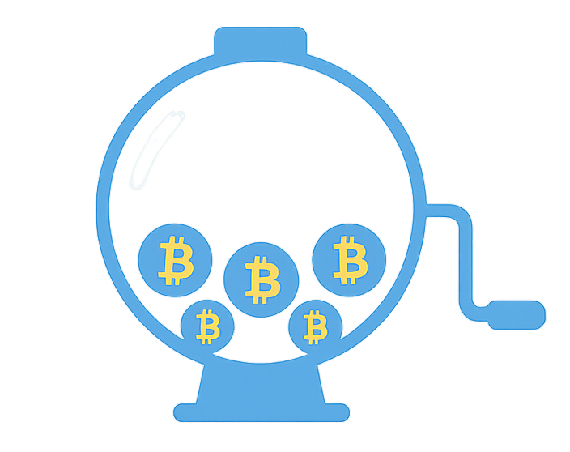

<p align="center">
  
</p>


# Transparent Lottery

Generation of pseudo-random numbers using a public algorithm based on Bitcoin network hashes.  
With this innovation, betting games, raffles, and prizes can benefit from the transparency of the draws, ensuring that results cannot be manipulated. With this algorithm, anyone can manually perform the operation, making the process transparent.

## Number Drawing

To generate random data for number formation, the hash of a specific Bitcoin block will be used. The block number is the draw number. Since a Bitcoin block is generated on average every 10 minutes, a draw can also be generated at the same interval. Upon obtaining the block hash— a 256-bit hash or 64 hexadecimal characters from 0 to F — it is converted to a decimal number. The conversion must consider all hexadecimal characters at once. This process yields up to 78 digits from 0 to 9. For the draw, only the 36 rightmost digits are used, since there can be a variable number of leading zeros depending on mining difficulty.

### Summary process:

1. Define the block number  
2. Extract the block hash  
3. Convert to decimal  
4. Extract 36 decimal digits

---

### Defining the Block Number

Choose a block number greater than the current Bitcoin block height, ensuring all bets can be placed in time.

### Extracting the Block Hash

Obtain the hash of the chosen block after its first confirmation, since players will be able to extract it after that point. The value must be a 256-bit hash (64 hexadecimal digits).

**Example**:  
For block 0, the hash is:

```
000000000019d6689c085ae165831e934ff763ae46a2a6c172b3f1b60a8ce26f
```

### Conversion to Decimal

After obtaining the hash, convert it to a decimal (base 10) value. The conversion must consider all hash digits simultaneously.

The hexadecimal representation uses digits from 0 to F, corresponding to values from 0 to 15. In decimal representation, each hexadecimal digit is converted using:

$$
d = \sum_{i=0}^{i=(64-1)} h_i \cdot 16^i
$$

Where:
- $d$ is the decimal value.
- $i$ is the digit position, from right to left, starting at 0 to 63.
- $h_i$ is the decimal value of the hexadecimal digit, as shown below:

| Hexadecimal | Decimal |
|-------------|---------|
| 0           | 0       |
| 1           | 1       |
| 2           | 2       |
| 3           | 3       |
| 4           | 4       |
| 5           | 5       |
| 6           | 6       |
| 7           | 7       |
| 8           | 8       |
| 9           | 9       |
| A           | 10      |
| B           | 11      |
| C           | 12      |
| D           | 13      |
| E           | 14      |
| F           | 15      |

#### Expanded formula

$$
d = h_0 \cdot 16^0 + h_1 \cdot 16^1 + h_2 \cdot 16^2 + h_3 \cdot 16^3 + h_4 \cdot 16^4 + h_5 \cdot 16^5 + h_6 \cdot 16^6 + h_7 \cdot 16^7 + h_8 \cdot 16^8 + h_9 \cdot 16^9 + h_10 \cdot 16^10 + h_11 \cdot 16^11 + h_12 \cdot 16^12 + h_13 \cdot 16^13 + h_14 \cdot 16^14 + h_15 \cdot 16^15 + h_16 \cdot 16^16 + h_17 \cdot 16^17 + h_18 \cdot 16^18 + h_19 \cdot 16^19 + h_20 \cdot 16^20 + h_21 \cdot 16^21 + h_22 \cdot 16^22 + h_23 \cdot 16^23 + h_24 \cdot 16^24 + h_25 \cdot 16^25 + h_26 \cdot 16^26 + h_27 \cdot 16^27 + h_28 \cdot 16^28 + h_29 \cdot 16^29 + h_30 \cdot 16^30 + h_31 \cdot 16^31 + h_32 \cdot 16^32 + h_33 \cdot 16^33 + h_34 \cdot 16^34 + h_35 \cdot 16^35 + h_36 \cdot 16^36 + h_37 \cdot 16^37 + h_38 \cdot 16^38 + h_39 \cdot 16^39 + h_40 \cdot 16^40 + h_41 \cdot 16^41 + h_42 \cdot 16^42 + h_43 \cdot 16^43 + h_44 \cdot 16^44 + h_45 \cdot 16^45 + h_46 \cdot 16^46 + h_47 \cdot 16^47 + h_48 \cdot 16^48 + h_49 \cdot 16^49 + h_50 \cdot 16^50 + h_51 \cdot 16^51 + h_52 \cdot 16^52 + h_53 \cdot 16^53 + h_54 \cdot 16^54 + h_55 \cdot 16^55 + h_56 \cdot 16^56 + h_57 \cdot 16^57 + h_58 \cdot 16^58 + h_59 \cdot 16^59 + h_60 \cdot 16^60 + h_61 \cdot 16^61 + h_62 \cdot 16^62 + h_63 \cdot 16^63
$$

#### Example:  
For the hash `000000000019d6689c085ae165831e934ff763ae46a2a6c172b3f1b60a8ce26f`, each digt separated is:

```
0, 0, 0, 0, 0, 0, 0, 0, 0, 0, 1, 9, d, 6, 6, 8, 9, c, 0, 8, 5, a, e, 1, 6, 5, 8, 3, 1, e, 9, 3, 4, f, f, 7, 6, 3, a, e, 4, 6, a, 2, a, 6, c, 1, 7, 2, b, 3, f, 1, b, 6, 0, a, 8, c, e, 2, 6, f
```

Using table conversion:


```
0, 0, 0, 0, 0, 0, 0, 0, 0, 0, 1, 9, 13, 6, 6, 8, 9, 12, 0, 8, 5, 10, 14, 1, 6, 5, 8, 3, 1, 14, 9, 3, 4, 15, 15, 7, 6, 3, 10, 14, 4, 6, 10, 2, 10, 6, 12, 1, 7, 2, 11, 3, 15, 1, 11, 6, 0, 10, 8, 12, 14, 2, 6, 15
```

The expanded formula is:

$$
d = 0 \cdot 16^0 + 0 \cdot 16^1 + 0 \cdot 16^2 + 0 \cdot 16^3 + 0 \cdot 16^4 + 0 \cdot 16^5 + 0 \cdot 16^6 + 0 \cdot 16^7 + 0 \cdot 16^8 + 0 \cdot 16^9 + 1 \cdot 16^10 + 9 \cdot 16^11 + 13 \cdot 16^12 + 6 \cdot 16^13 + 6 \cdot 16^14 + 8 \cdot 16^15 + 9 \cdot 16^16 + 12 \cdot 16^17 + 0 \cdot 16^18 + 8 \cdot 16^19 + 5 \cdot 16^20 + 10 \cdot 16^21 + 14 \cdot 16^22 + 1 \cdot 16^23 + 6 \cdot 16^24 + 5 \cdot 16^25 + 8 \cdot 16^26 + 3 \cdot 16^27 + 1 \cdot 16^28 + 14 \cdot 16^29 + 9 \cdot 16^30 + 3 \cdot 16^31 + 4 \cdot 16^32 + 15 \cdot 16^33 + 15 \cdot 16^34 + 7 \cdot 16^35 + 6 \cdot 16^36 + 3 \cdot 16^37 + 10 \cdot 16^38 + 14 \cdot 16^39 + 4 \cdot 16^40 + 6 \cdot 16^41 + 10 \cdot 16^42 + 2 \cdot 16^43 + 10 \cdot 16^44 + 6 \cdot 16^45 + 12 \cdot 16^46 + 1 \cdot 16^47 + 7 \cdot 16^48 + 2 \cdot 16^49 + 11 \cdot 16^50 + 3 \cdot 16^51 + 15 \cdot 16^52 + 1 \cdot 16^53 + 11 \cdot 16^54 + 6 \cdot 16^55 + 0 \cdot 16^56 + 10 \cdot 16^57 + 8 \cdot 16^58 + 12 \cdot 16^59 + 14 \cdot 16^60 + 2 \cdot 16^61 + 6 \cdot 16^62 + 15 \cdot 16^63
$$

The results is

```
170063117907496993344802296311112793286231433463274784309528897279
```

### Extracting 36 Decimal Digits

After conversion, extract the 36 rightmost digits (from right to left):

#### Example

For `170063117907496993344802296311112793286231433463274784309528897279`, 32 the 36 rightmost digits is

```
112793286231433463274784309528897279
```

## Generating Draw Results

From the resulting number, draw results can be generated using the following patterns:

- **Nonets**: 4 numbers with 9 digits each (0 to 999,999,999)  
- **Sextets**: 6 numbers with 6 digits each (0 to 999,999)  
- **Quartets**: 9 numbers with 4 digits each (0 to 9,999)  
- **Trios**: 12 numbers with 3 digits each (0 to 999)  
- **Pairs**: 18 numbers with 2 digits each (0 to 99)

**Example with number**: `112793286231433463274784309528897279`

- **Nonets**:  
  `112793286`, `231433463`, `274784309`, `528897279`

- **Sextets**:  
  `112793`, `286231`, `433463`, `274784`, `309528`, `897279`

- **Quartets**:  
  `1127`, `9328`, `6231`, `4334`, `6327`, `4784`, `3095`, `2889`, `7279`

- **Trios**:  
  `112`, `793`, `286`, `231`, `433`, `463`, `274`, `784`, `309`, `528`, `897`, `279`

- **Pairs**:  
  `11`, `27`, `93`, `28`, `62`, `31`, `43`, `34`, `63`, `27`, `47`, `84`, `30`, `95`, `28`, `89`, `72`, `79`

---

## Bet Verification

The drawn number is only considered valid if the block has **6 or more confirmations**.  
It is not recommended to pay prizes before these confirmations.  
A bet is verified by checking whether each player correctly guessed the drawn number.

**Odds per draw type**:

- **Nonets**: 1 in 1 billion (0.0000001%)  
- **Sextets**: 1 in 1 million (0.0001%)  
- **Quartets**: 1 in 10 thousand (0.01%)  
- **Trios**: 1 in 1 thousand (0.1%)  
- **Pairs**: 1 in 100 (1%)

---
Copyright (C) 2025 D. H. B. Marcos

D. O. G.
